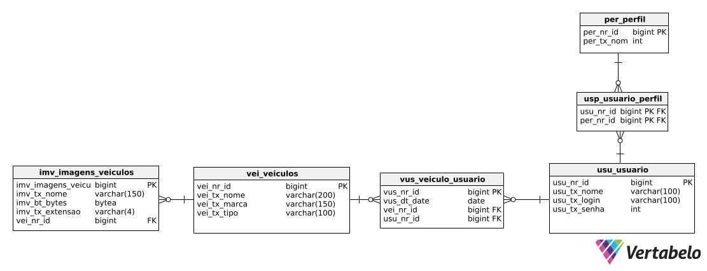

# Reserva de Veículos API

A API foi criada para um sistema de reserva de veículos. O objetivo principal da aplicação é permitir que seus usuários
reservem um ou mais veículos durante x dias.

## Lista de checkpoints

A lista de checkpoints é um guia simples e bem resumido sobre alguns pontos interessantes no desenvolvimento do projeto.

    🔳 Criação do Banco de Dados com base no modelo passado
    🔳 Mapeamento do modelo do banco de dados na aplicação Spring;
    🔳 Gerenciamento do modelo via Flyway;
    🔳 Endpoints CRUD(Create, Read, Update, Delete) das principais entidades;
    🔳 Implementação da autenticação via JWT(Json Web Token) no Spring Security;
    🔳 Documentação da API com Swagger.

## 📚 Bibliotecas já instaladas

Novas bibliotecas podem ser adicionadas ao projeto, porém já definimos algumas para facilitar o entendimento do mesmo.

- Spring Web
- Spring Data JPA
- Flyway
- PostgreSQL Driver
- Lombok

## Modelo Relacional do Banco de Dados

Abaixo está o modelo relacional do banco de dados desta aplicação; este modelo deve ser utilizado no desenvolvimento
da aplicação.

## 🛑 Requisitos para executar a aplicação

### Executar na sua máquina

- ✅ Java JDK LTS 21
- ✅ IDE (Visual Studio Code, Eclipse, IntelliJ, Spring Tool Suite)
- ✅ Postman/Insomnia (Ferramentas para realizar testes na API)
- ✅ SGBD(Sistema de Gerenciamento de Banco de Dados) PostgreSQL
